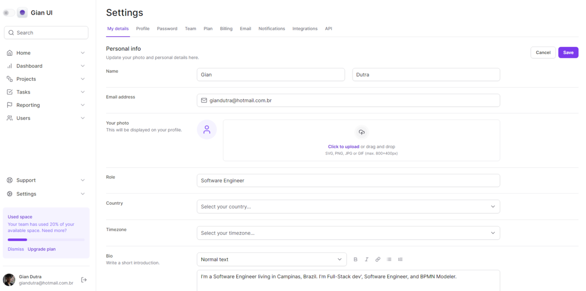
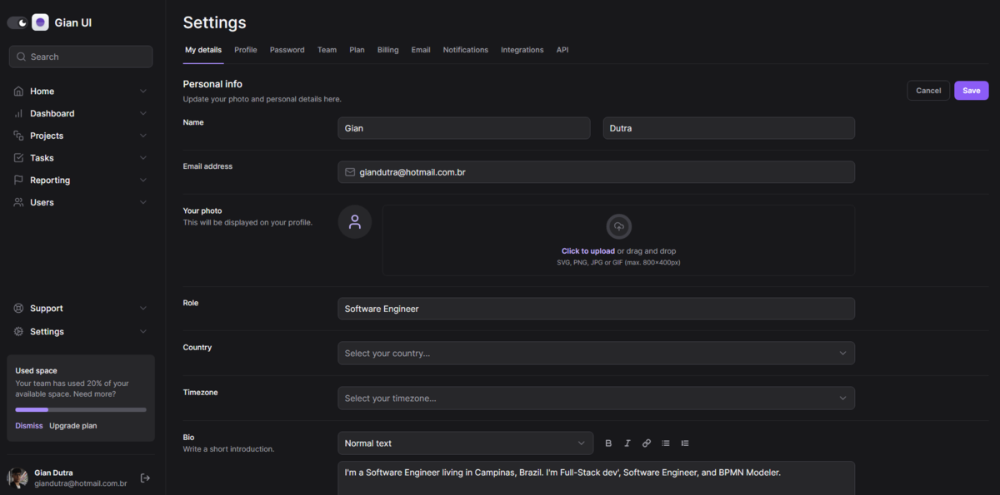

# Tailwind CSS Form

<p align="center">
  

   <a href="https://github.com/GianDutra/tailwind-nextjs/commits/master">
    
  </a>
  
 <a href="https://tailwind-nextjs-sable.vercel.app/">
    
  </a>
  
</p>




> Challenge performed during the Tailwind CSS mini-course at RocketSeat's ignite bootcamp

## Tech Stack

To create the website, the following was used:

#### **Website**   ([NextJS](https://nextjs.org/)  +  [React](https://reactjs.org/)  +  [TypeScript](https://www.typescriptlang.org/))
- **[TailWindCSS](https://tailwindcss.com/)**
- **[Lucide](https://lucide.dev/)**
- **[FramerMotion](https://www.framer.com/motion/)**
- **[RadixUI](https://www.radix-ui.com/)**
- **[Auto-animate](https://auto-animate.formkit.com/)**
- **[Next Themes](https://www.npmjs.com/package/next-themes)**
- **[Tailwind-merge && Tailwind-variants && Tailwind-scrollbar](https://tailwindcss.com/)**

## To-do list

- [x] Responsive Mode
- [x] Dark Theme
- [x] Light/Dark Toggle Button
- [x] FileInput with error, progress and complete mode(you can switch to viewing it inside the FileList.tsx file)

## 💻 Prerequisites

Before you start, make sure you have installed:

* [Node.js](https://nodejs.org/en/)
* [Git](https://git-scm.com)
* [Pnpm](https://pnpm.io)

## 🚀 Installing <ignite_redux_zustand>

 
```bash

# Clone this repository
$ git clone git@github.com:GianDutra/tailwind-nextjs.git

# Access the project folder in your terminal
$ cd tailwind-nextjs

# Install the dependencies
$ pnpm install

# Run the application in developer mode
$ pnpm run dev

# The app will open by default on port: 3000 - go to http://localhost:3000/

```

---


## 👨‍💼 Author

<table>
  <tr>
    <td align="center">
      <a href="#">
        <br>
        <sub>
          <b>Gian Dutra</b>
        </sub>
      </a>
    </td>
  </tr>
</table>
